# 1. Installation & Setup

The KUKA robot vision example is a set of KRL modules (`.src` / `.dat`) together with an EthernetKRL configuration file (`.xml`). Before running the program, copy the files to the robot controller and configure the network connection to the Machine Vision Device.

The example is available once per KUKA system software. Pick the file set that matches your controller and follow the corresponding section below — [KUKA System Software KSS](#for-kuka-system-software-kss) or [KUKA System Software iiQKA.OS2](#for-kuka-system-software-iiqkaos2).

## Supported controllers

| System software | Controller | Tested software | Notes |
| --- | --- | --- | --- |
| KSS | KRC4 | KSS 8.3.33, EthernetKRL 3.2.4 | Reference setup, tested with a KR 6 R1820 Arc robot arm. |
| KSS | KRC5 | — | Additionally tested. |
| iiQKA.OS2 | KR C5-2, KR C5 micro-2 | iiQKA.OS2 KSS9.2 or higher, iiQKA.EthernetKRL V6.1.2 | Requires the PC software iiQWorks.Cockpit 1.3 and iiQWorks.Sim 1.2. |

The socket communication uses the **EthernetKRL (EKI)** technology package, which must be installed on the controller. On iiQKA.OS2 it is the **iiQKA.EthernetKRL** option package.

## Files

Get the robot example from this repository's [`sources`](https://github.com/wenglor/robot-vision-kuka/tree/main/sources) directory. It is provided once per system software, in the folders `KSS` and `iiQKA.OS2`. **Transfer only the set that matches your controller.**

Both sets contain the same four components:

- `wenglorUserConfig.src` / `.dat` — user configuration (use case, poses, jobs) and the pose movement procedures. See [User Configuration](2_0_0_user_configuration.md).
- `wenglorGlobal.src` / `.dat` — core and helper functions (EKI socket communication, unit and rotation conversions, error handling).
- `wenglorMain.src` / `.dat` — program entry point: connects, runs the selected user command, and closes the connection.
- `wenglorVision.xml` — EthernetKRL channel configuration (IP address and port of the robot server).

In the `iiQKA.OS2` folder, every file carries the prefix `iiQKA_` — for example `iiQKA_wenglorUserConfig.src` and `iiQKA_wenglorVision.xml`.

!!! note

    On the Machine Vision Device website (Tab `Jobs` → `Robot Server`), make sure the robot server is active and the robot manufacturer is set to **KUKA**. This applies to both system software variants. See [Settings on Device Website](https://wenglor.github.io/robot-vision-generic-string/5_2_0_settings_on_device_website/) in the wenglor robot vision manual.

## For KUKA System Software KSS

Use the files from the `KSS` folder.

### EthernetKRL configuration (`wenglorVision.xml`)

Edit the file `wenglorVision.xml`:

- Adjust the **IP address** of the Machine Vision Device (by default `192.168.100.1`).
- Adjust the **port** of the robot server (by default `6008`).

Then copy `wenglorVision.xml` to the following location on the robot controller:

```text
C:\KRC\ROBOTER\Config\User\Common\EthernetKRL\
```

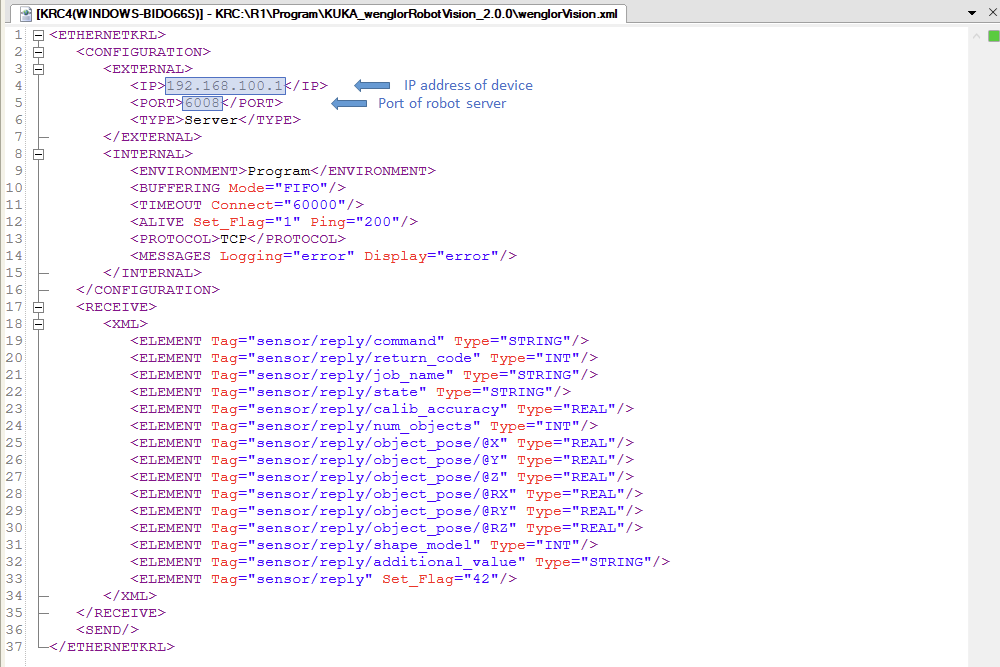

!!! note

    The name `wenglorVision` used at `W_CONNECTION[]` in `wenglorUserConfig.src` must match the name of the XML file. By default, the names already match — do not rename it.

### Copy the program to the controller

Copy the `wenglorGlobal`, `wenglorMain` and `wenglorUserConfig` module files (`.src` and `.dat`) to the robot controller, for example under `KRC:\R1\Program`.

## For KUKA System Software iiQKA.OS2

Use the files from the `iiQKA.OS2` folder.

### System requirements

- Controller: **KR C5-2** or **KR C5 micro-2**
- Operating system: **iiQKA.OS2 KSS9.2** or higher
- Software: **iiQKA.EthernetKRL V6.1.2**
- PC software:
    - **iiQWorks.Cockpit 1.3** to download option packages
    - **iiQWorks.Sim 1.2** to install option packages on the robot

!!! note

    Use the KUKA software iiQWorks.Sim to transfer the files to the robot.

### Add the option package

In iiQWorks.Cockpit, open the `Software Repository`, select **iiQKA.EthernetKRL** in version `6.1.2` and download it.

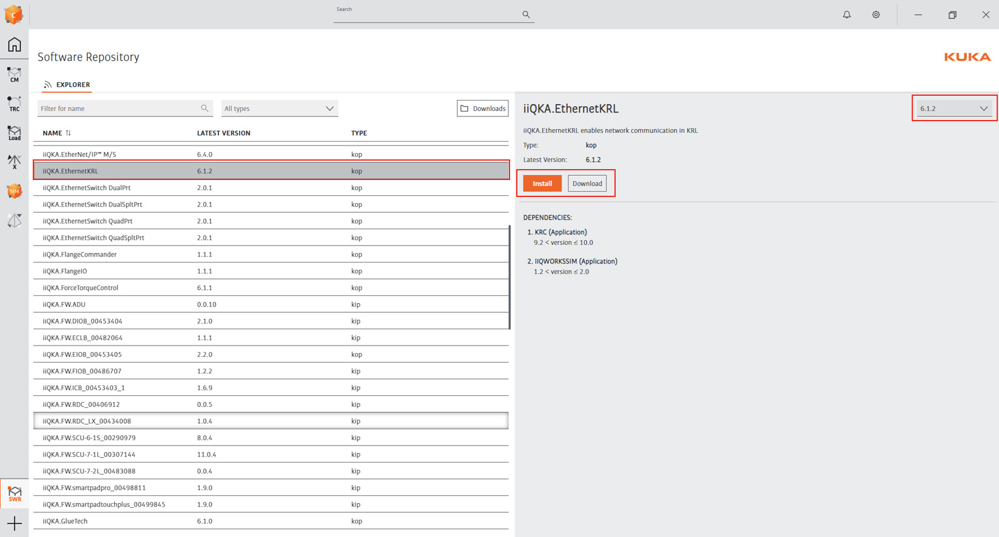

Then switch to iiQWorks.Sim, select the robot in the `Devices` tree and add **iiQKA.EthernetKRL** from `Option packages configuration` → `Available options` to the controller.

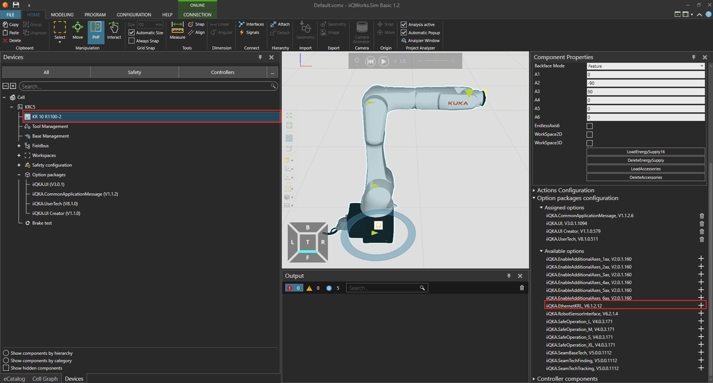

Once installed, the option package appears under `Option packages` with the entries `General settings` and `Ethernet configuration`.

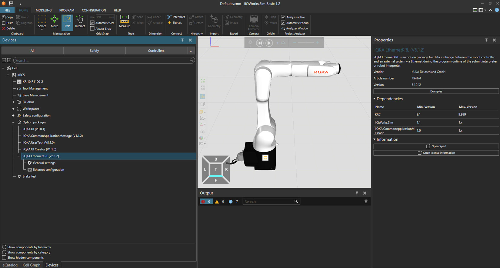

### Adjust the wenglor configuration files

Go to `Option packages` → `iiQKA.EthernetKRL (V6.1.2)` → `Ethernet configuration` and import the `iiQKA_wenglorVision.xml` file into the configuration.

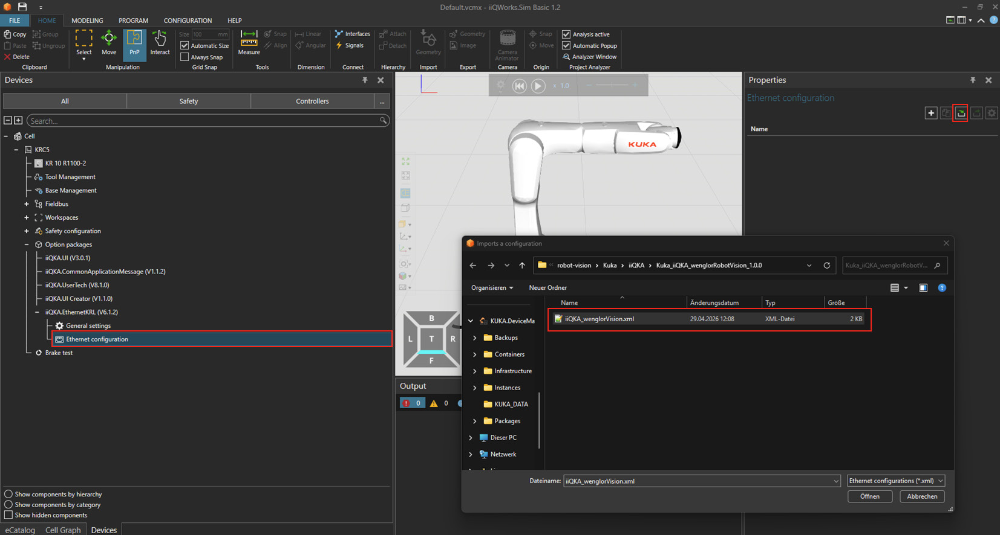

The imported channel now appears as `iiQKA_wenglorVision`. Select it and open the configuration for editing.

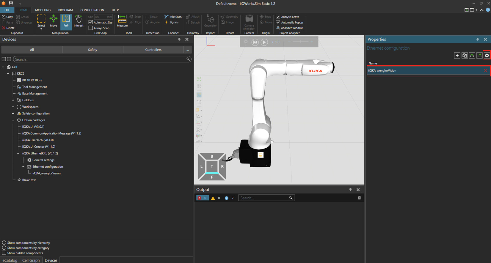

In the `<Client>` element of the channel configuration:

- Adjust the **IP address** of the Machine Vision Device (by default `192.168.100.1`).
- Adjust the **port** of the robot server (by default `6008`).

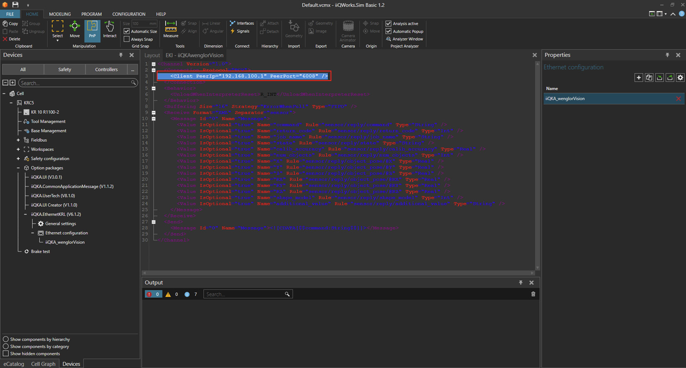

!!! note

    The name `iiQKA_wenglorVision` used at `W_CONNECTION[]` in `iiQKA_wenglorUserConfig.src` must match the name of the XML file. By default, the names already match — do not rename it.

### Import the robot programs

Go to `PROGRAM`, right-click the `Program` folder and choose `Import` → `Import KRL directory`.

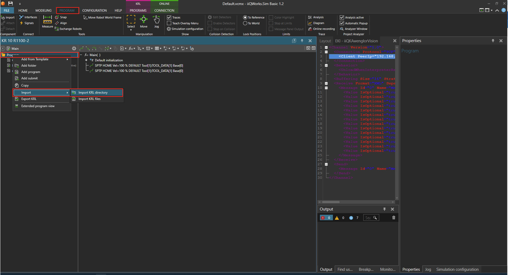

Select the `iiQKA.OS2` folder.

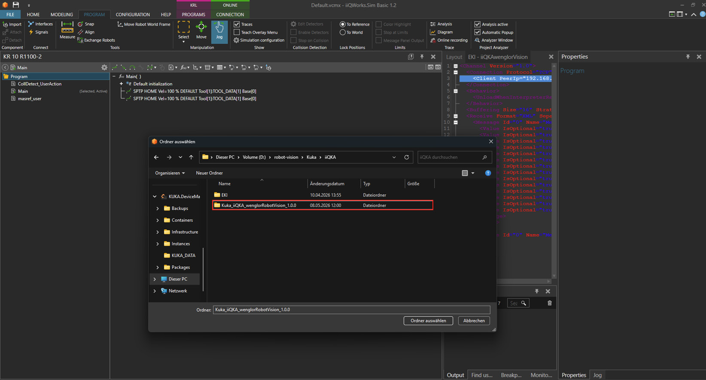

Finally, transfer the configuration and the robot programs to the robot with `CONFIGURATION` → `Deploy Configuration onto Controller`.

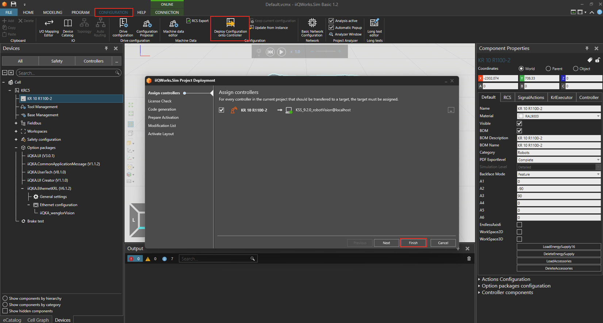

## Running the program

After updating the [user configuration](2_0_0_user_configuration.md) to match your setup and teaching the poses, run the main module to start the calibration and the detection:

- **KSS** — run `wenglorMain.src`.
- **iiQKA.OS2** — select `iiQKA_wenglorMain` on the robot panel.

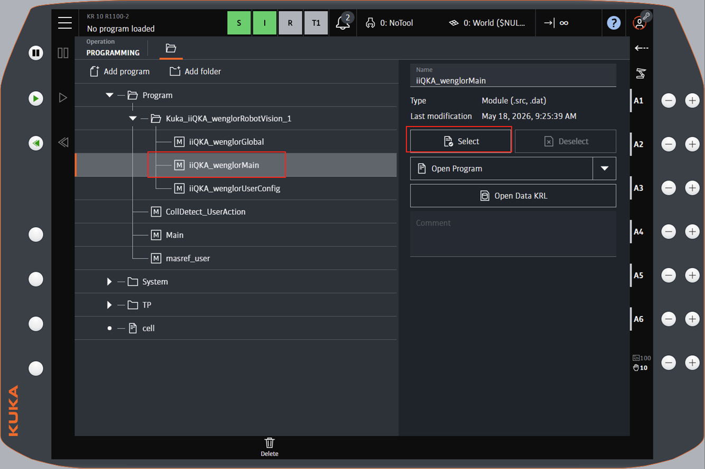
