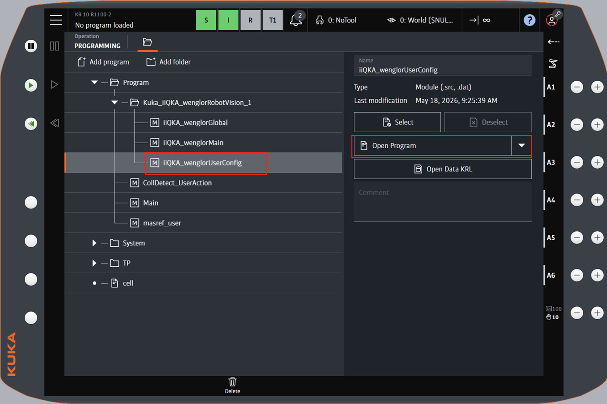
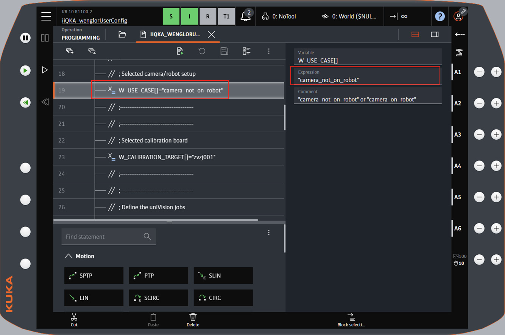
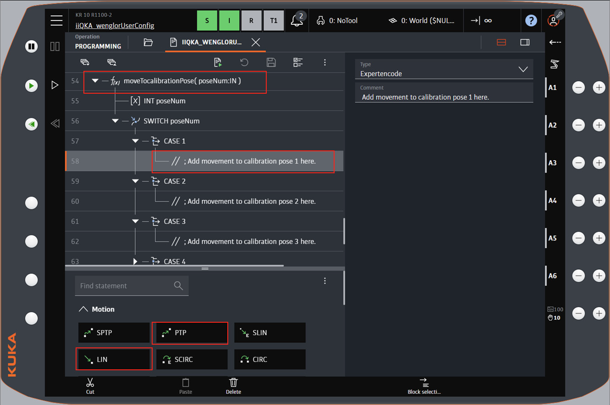

# 2. User Configuration

All parameters you need to adapt to your setup are located in the `wenglorUserConfig` module. Adjust them according to your needs before running the program.

The parameters and the poses to teach are identical for both KUKA system software variants. Only the file and channel names differ: the KSS set uses `wenglorUserConfig.src` with the channel `wenglorVision`, the iiQKA.OS2 set uses `iiQKA_wenglorUserConfig.src` with the channel `iiQKA_wenglorVision`. How you open and edit the module differs as well — see [KUKA System Software KSS](#for-kuka-system-software-kss) or [KUKA System Software iiQKA.OS2](#for-kuka-system-software-iiqkaos2) below.

## Parameters

Edit the following parameters in `wenglorUserConfig.src`:

/// html | div.col-widths
    attrs: {style: "--w1: 32%; --w2: 68%;"}

| Parameter | Description |
| --- | --- |
| `W_CONNECTION[]` | Name of the EthernetKRL channel. Must match the name of the XML file — `wenglorVision` on KSS, `iiQKA_wenglorVision` on iiQKA.OS2. By default, the names already match — **do not rename it**. |
| `W_USE_CASE[]` | Defines whether the camera is on the robot or not (`camera_on_robot` or `camera_not_on_robot`). |
| `W_CALIBRATION_TARGET[]` | ID of the calibration plate: `zvzj001`, `zvzj002`, `zvzj003`, `zvzj004`, `24x30mm`, `375x550mm`, or `550x800mm`. Select `zvzj001` if using ZVZJ005 and `zvzj002` if using ZVZJ006 (same size). |
| `W_CALIBRATION_JOB[]` | Name of the uniVision job for calibration. |
| `W_DETECT_OBJECTS_JOB[]` | Name of the uniVision job for detection. |
| `W_DETECT_TARGET_JOB[]` | Name of the uniVision job for detecting the calibration plate (used by `updateReferenceFrame`). |
| `W_SAFETY_OFFSET_MM` | Z offset in millimeters for the validation of the calibration. |
| `W_NUM_CALIBRATION_POSES` | Number of calibration poses to use. At least **5** poses are required, and the value must match the number of poses taught in `moveTocalibrationPose()`. |
| `W_USER_COMMAND[]` | The routine to execute (`singleDetection`, `multiDetection`, or `updateReferenceFrame`). |
| `W_BASE_NUM` | Base number used for the reference frame in the `updateReferenceFrame` use case. |
| `W_BASE_NAME[]` | Name of the reference frame base (`wReferenceFrame` by default). |
| `W_MACHINE_POSES_TAUGHT` | Set to `TRUE` after teaching the poses relative to the reference frame in the `updateReferenceFrame` use case. See [Robot Program → `updateReferenceFrame`](3_0_0_robot_program.md#updatereferenceframe). |
///

## Mobile platform use case

For the mobile platform use case (`updateReferenceFrame`), also set `W_BASE_NUM`, `W_BASE_NAME[]`, and `W_MACHINE_POSES_TAUGHT` as described in the table above. For the general concept, see [Wenglor Robot Server overview](https://wenglor.github.io/robot-vision-generic-string/5_1_0_basics_with_robot_server/) in the wenglor robot vision manual.

## Teaching the poses

The movements to the robot poses are defined in the pose procedures of `wenglorUserConfig.src`. Add the movements to your taught poses inside them:

/// html | div.col-widths
    attrs: {style: "--w1: 38%; --w2: 62%;"}

| Procedure | Purpose |
| --- | --- |
| `moveTocalibrationPose(poseNum)` | Moves to each calibration pose (`CASE 1` … `CASE 5`). Add or remove `CASE` blocks to match `W_NUM_CALIBRATION_POSES`. |
| `moveToDetectObjectsPose()` | Moves to the detection pose used for object recognition. |
| `moveToSafetyPose()` | Moves to a safety pose so the operator can remove the calibration plate (`camera_not_on_robot` only). |
| `moveToDetectTargetPose()` | Moves to the pose from which the calibration target is detected (`updateReferenceFrame` only). |
///

Teach a minimum of five calibration poses (more can be added for better accuracy) in `moveTocalibrationPose()`. Then teach the detection pose (`moveToDetectObjectsPose()`), the safety pose (`moveToSafetyPose()`, `camera_not_on_robot` only), and the target pose (`moveToDetectTargetPose()`, `updateReferenceFrame` only).

!!! note

    The number of taught poses must match `W_NUM_CALIBRATION_POSES`. To add poses, copy a `CASE` block in `moveTocalibrationPose()`, increase the pose number, and update `W_NUM_CALIBRATION_POSES` accordingly.

To test the calibration poses you can call the function `testCalibrationPoses()`. It must be called from `wenglorMain.src`.

For details on how these poses are used in the calibration and detection flow, see [Robot Program](3_0_0_robot_program.md).

!!! note

    Also check that **KUKA** is selected in the robot manufacturer drop-down of the robot server on the Machine Vision Device website (e.g. B60, MVC). See [Settings on Device Website](https://wenglor.github.io/robot-vision-generic-string/5_2_0_settings_on_device_website/) in the wenglor robot vision manual.

## For KUKA System Software KSS

Open `wenglorUserConfig.src` in the program editor and edit the parameters directly in the source text.

Add the movements to your taught calibration poses inside the `CASE` blocks of `moveTocalibrationPose()`.

Do the same for the detection pose, the safety pose and the target pose in their respective procedures.

Call `testCalibrationPoses()` from `wenglorMain.src` to move to all taught calibration poses in sequence.

## For KUKA System Software iiQKA.OS2

Open the `iiQKA_wenglorUserConfig` program on the robot panel.

Select a parameter line to edit its value in the property pane on the right — here the use case `W_USE_CASE[]`. Work through the remaining parameters in the same way.

To teach the poses, navigate to the `CASE` block of the pose you want to teach in `moveTocalibrationPose()`, then insert a motion command from the statement palette at the bottom of the screen (for example `PTP` or `LIN`). Teach the detection, safety and target poses the same way in their respective procedures.

