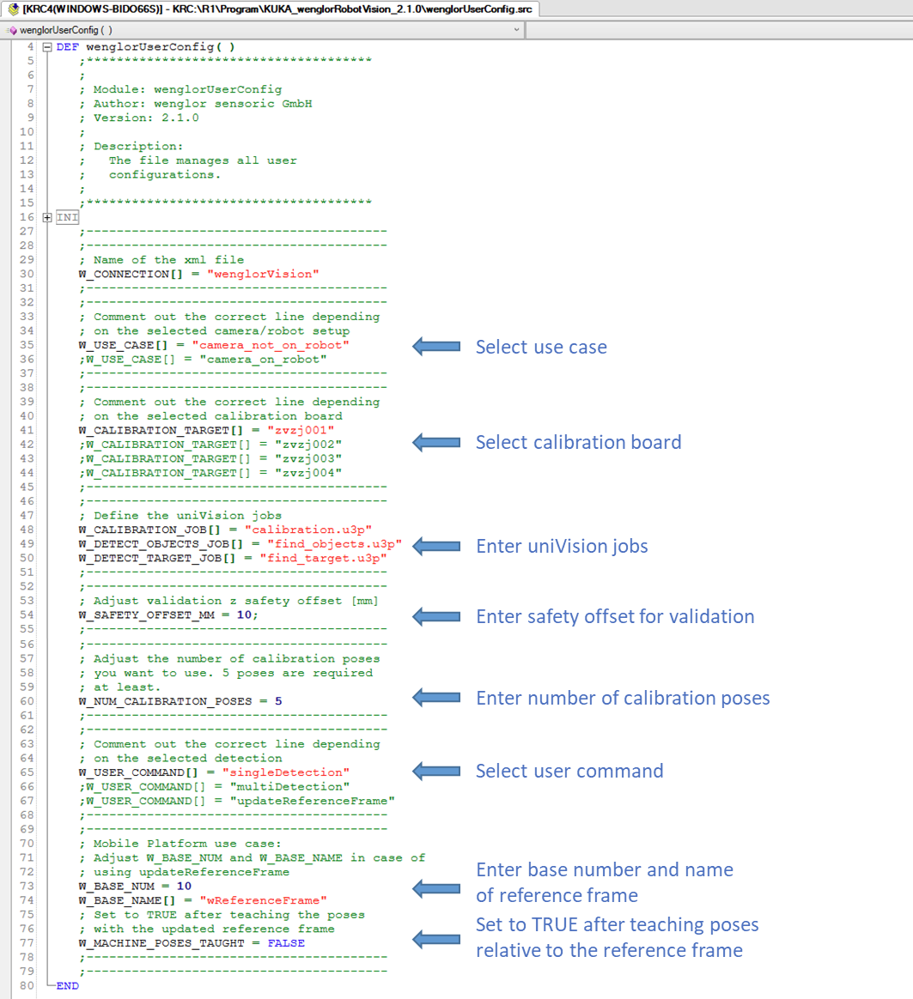
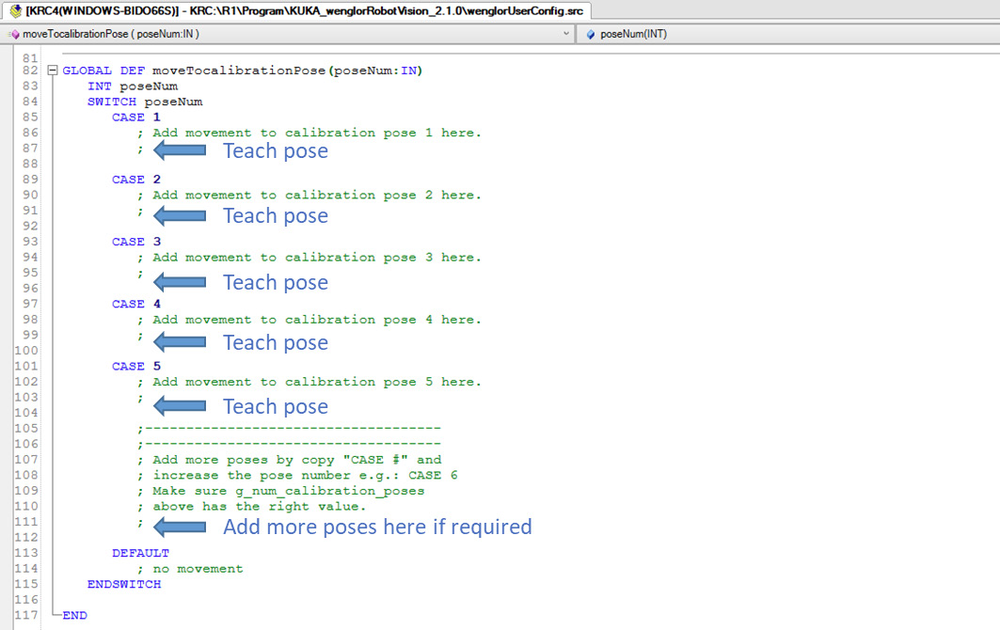
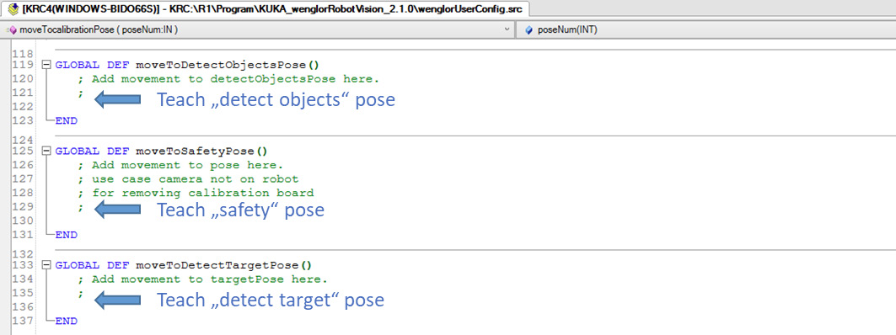
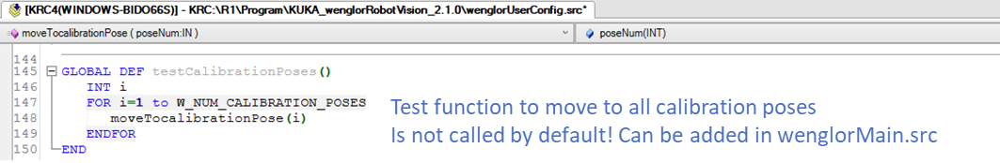

# 2. User Configuration

All parameters you need to adapt to your setup are located in the `wenglorUserConfig` module. Adjust them according to your needs before running the program.

## Parameters

Edit the following parameters in `wenglorUserConfig.src`:

/// html | div.col-widths
    attrs: {style: "--w1: 32%; --w2: 68%;"}

| Parameter | Description |
| --- | --- |
| `W_CONNECTION[]` | Name of the EthernetKRL channel. Must match the name of the `wenglorVision.xml` file. By default, the names already match — **do not rename it**. |
| `W_USE_CASE[]` | Defines whether the camera is on the robot or not (`camera_on_robot` or `camera_not_on_robot`). |
| `W_CALIBRATION_TARGET[]` | ID of the calibration plate: `zvzj001`, `zvzj002`, `zvzj003`, or `zvzj004`. Select `zvzj001` if using ZVZJ005 and `zvzj002` if using ZVZJ006 (same size). |
| `W_CALIBRATION_JOB[]` | Name of the uniVision job for calibration. |
| `W_DETECT_OBJECTS_JOB[]` | Name of the uniVision job for detection. |
| `W_DETECT_TARGET_JOB[]` | Name of the uniVision job for detecting the calibration plate (used by `updateReferenceFrame`). |
| `W_SAFETY_OFFSET_MM` | Z offset in millimeters for the validation of the calibration. |
| `W_NUM_CALIBRATION_POSES` | Number of calibration poses to use. At least **5** poses are required, and the value must match the number of poses taught in `moveTocalibrationPose()`. |
| `W_USER_COMMAND[]` | The routine to execute (`singleDetection`, `multiDetection`, or `updateReferenceFrame`). |
| `W_BASE_NUM` | Base number used for the reference frame in the `updateReferenceFrame` use case. |
| `W_BASE_NAME[]` | Name of the reference frame base (`wReferenceFrame` by default). |
| `W_MACHINE_POSES_TAUGHT` | Set to `TRUE` after teaching the poses relative to the reference frame in the `updateReferenceFrame` use case. See [Robot Program → `updateReferenceFrame`](3_0_0_robot_program.md#updatereferenceframe). |
///

## Mobile platform use case

For the mobile platform use case (`updateReferenceFrame`), also set `W_BASE_NUM`, `W_BASE_NAME[]`, and `W_MACHINE_POSES_TAUGHT` as described in the table above. For the general concept, see [Wenglor Robot Server overview](https://wenglor.github.io/robot-vision-generic-string/4_0_0_robot_vision_server/) in the wenglor robot vision manual.

## Teaching the poses

The movements to the robot poses are defined in the pose procedures of `wenglorUserConfig.src`. Add the movements to your taught poses inside them:

/// html | div.col-widths
    attrs: {style: "--w1: 38%; --w2: 62%;"}

| Procedure | Purpose |
| --- | --- |
| `moveTocalibrationPose(poseNum)` | Moves to each calibration pose (`CASE 1` … `CASE 5`). Add or remove `CASE` blocks to match `W_NUM_CALIBRATION_POSES`. |
| `moveToDetectObjectsPose()` | Moves to the detection pose used for object recognition. |
| `moveToSafetyPose()` | Moves to a safety pose so the operator can remove the calibration plate (`camera_not_on_robot` only). |
| `moveToDetectTargetPose()` | Moves to the pose from which the calibration target is detected (`updateReferenceFrame` only). |
///

Teach a minimum of five calibration poses (more can be added for better accuracy) in `moveTocalibrationPose()`.

!!! note

    The number of taught poses must match `W_NUM_CALIBRATION_POSES`. To add poses, copy a `CASE` block in `moveTocalibrationPose()`, increase the pose number, and update `W_NUM_CALIBRATION_POSES` accordingly.

For the detection pose (`moveToDetectObjectsPose()`), the safety pose (`moveToSafetyPose()`, `camera_not_on_robot` only), and the target pose (`moveToDetectTargetPose()`, `updateReferenceFrame` only):

To test the calibration poses you can call the function `testCalibrationPoses()`. It must be called from `wenglorMain.src`.

For details on how these poses are used in the calibration and detection flow, see [Robot Program](3_0_0_robot_program.md).

!!! note

    Also check that **KUKA** is selected in the robot manufacturer drop-down of the robot server on the Machine Vision Device website (e.g. B60, MVC). See [Settings on Device Website](https://wenglor.github.io/robot-vision-generic-string/4_3_0_settings_on_device_website/) in the wenglor robot vision manual.
