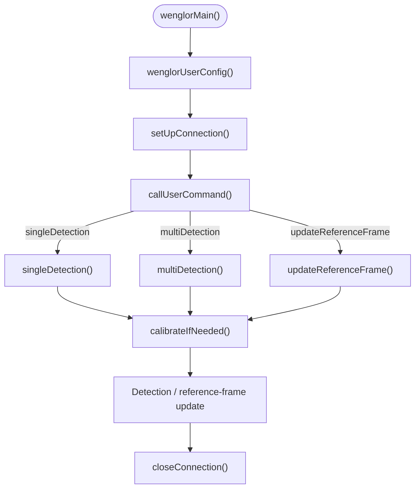

# 3. Robot Program

The example program implements a complete robot vision workflow: calibrating the camera to the robot, detecting objects, and moving to them. It is split into several KRL modules.

The program flow is the same for both KUKA system software variants. The module names below are the ones used by the KSS file set; in the iiQKA.OS2 file set, each module carries the prefix `iiQKA_` — for example `iiQKA_wenglorMain`.

## Modules

/// html | div.col-widths
    attrs: {style: "--w1: 26%; --w2: 74%;"}

| Module | Responsibility |
| --- | --- |
| `wenglorUserConfig` | All user-adjustable parameters and the pose movement procedures. See [User Configuration](2_0_0_user_configuration.md). |
| `wenglorGlobal` | EKI socket communication, unit (mm ↔ m) and rotation (Euler ↔ rotation-vector) conversions, error handling. |
| `wenglorMain` | Program entry point. Sets up the connection, runs the selected user command, and closes the connection. Contains the `main` routine. |
///

## Program flow

The program entry point is the `wenglorMain` routine. It initializes the user configuration, opens the EKI connection to the wenglor robot server, runs the selected user command, and closes the connection again:

```text
DEF wenglorMain( )
   ; Initialization of user configuration
   wenglorUserConfig()
   ; Try to connect to wenglor robot server
   setUpConnection()
   ; run singleDetection, multiDetection or updateReferenceFrame
   callUserCommand()
   ; Close connection with wenglor robot server
   closeConnection()
END
```

Depending on `W_USER_COMMAND[]`, `callUserCommand()` runs one of three routines:

```text
DEF callUserCommand()
   IF (StrComp(W_USER_COMMAND[], "singleDetection", #NOT_CASE_SENS)) THEN
      singleDetection()
   ELSE
      IF (StrComp(W_USER_COMMAND[], "multiDetection", #NOT_CASE_SENS)) THEN
         multiDetection()
      ELSE
         IF (StrComp(W_USER_COMMAND[], "updateReferenceFrame", #NOT_CASE_SENS)) THEN
            updateReferenceFrame()
         ENDIF
      ENDIF
   ENDIF
END
```



Each routine first calls `calibrateIfNeeded()`, which runs a calibration if no calibration data is available on the device yet, and validates it afterwards.

## Calibration

The calibration process differs depending on whether the camera is mounted on the robot or not. The sections below describe only how the **KUKA example** performs each case.

!!! note

    For the general calibration concepts — which calibration plate to use, how to choose and vary the poses, and how to read the reprojection error — see the [Wenglor Robot Server overview](https://wenglor.github.io/robot-vision-generic-string/5_1_0_basics_with_robot_server/) in the wenglor robot vision manual. The description here does not repeat them.

The movements are defined in `moveTocalibrationPose()` in `wenglorUserConfig.src`; `runCalibration()` in `wenglorGlobal` iterates through them and calls `calibration:add` at each pose.

You can verify your calibration movements without running the full program by calling the `testCalibrationPoses()` routine, which moves through all defined calibration poses.

| | Camera on robot | Camera not on robot |
| --- | --- | --- |
| Calibration poses | Move through the calibration poses with the calibration plate fixed in the workspace. | Move through the calibration poses with the calibration plate mounted on the robot. |
| Extra step | None. | Move to the safety pose (`moveToSafetyPose()`) so the operator can remove the plate and place it on the measuring/picking plane; the camera-to-ground relation is then calibrated (`calibration:ground`). |
| Detection pose | Identical to the first calibration pose. | Taught separately in `moveToDetectObjectsPose()`, chosen so the robot arm does not block the camera image. |

### Camera on robot

The **detection pose is identical to the first calibration pose** — choose a pose from which the objects can be reached safely.

### Camera not on robot

The calibration consists of two steps:

1. Mount the calibration plate on the robot and move through the calibration poses.
2. The robot moves to the safety pose (`moveToSafetyPose()`) so the operator can remove the calibration plate and place it on the measuring/picking plane; the camera-to-ground relation is then calibrated (`calibration:ground`).

The robot program requires small adjustments depending on your setup — see [User Configuration → Teaching the poses](2_0_0_user_configuration.md#teaching-the-poses) to teach the calibration, detection, safety, and target poses.

### Verification

After calibration, `validateCalibration()` performs a verification step: it moves the robot TCP to the position reported by the camera, offset upward by `W_SAFETY_OFFSET_MM`, so the operator can visually confirm accuracy. The calibration plate must not be moved between calibration and verification.

!!! note

    For what a good calibration looks like (Z-axis orientation, expected reprojection error values), see the [Wenglor Robot Server overview](https://wenglor.github.io/robot-vision-generic-string/5_1_0_basics_with_robot_server/) in the wenglor robot vision manual.

## Detection

After successful calibration, the program detects objects. With the object pose sent by the camera, the robot moves to the object.

### `singleDetection`

Loads the detection job, moves to the detection pose, requests a single object pose, and moves to it:

```text
DEF singleDetection()
   isCalibrated = calibrateIfNeeded()
   IF (isCalibrated == FALSE) THEN
      RETURN
   ENDIF
   loadJob(W_DETECT_OBJECTS_JOB[])
   moveToDetectObjectsPose()
   objectPose = detectObjects()
   shapeModel = readShapeByIndex(0)
   moveTo(objectPose)
END
```

### `multiDetection`

Reads the number of detected objects and iterates over all of them, moving to each object and returning to the detection pose in between:

```text
objectPose = detectObjects()
numObjects = readNumObjects()
FOR index = 0 TO numObjects-1 STEP 1
   objectPose = readPoseByIndex(index)
   shapeModel = readShapeByIndex(index)
   moveTo(objectPose)
   moveToDetectObjectsPose()
ENDFOR
```

You can extend this with conditional checks on the shape model or an additional value. To use an additional value, link it in the uniVision job and uncomment the `readValueByIndex()` call.

### `updateReferenceFrame`

Used for mobile platforms and similar use cases (e.g. correcting positional deviations of a mobile platform in front of a machine or shelf). It detects the calibration target, updates the reference frame base, and — once the machine poses have been taught relative to that frame — moves to them. `detectTarget()` sends the `target:pose` command; see [Target Pose and Camera-to-Target](https://wenglor.github.io/robot-vision-generic-string/5_5_0_target_pose_and_camera_to_target/) in the wenglor robot vision manual for details on this command:

```text
targetPose = detectTarget()
setBase(W_BASE_NUM, W_BASE_NAME[], targetPose)
$BASE = BASE_DATA[W_BASE_NUM]

IF (W_MACHINE_POSES_TAUGHT == FALSE) THEN
   MsgNotify("Reference frame updated. Teach poses relative to the reference frame and set W_MACHINE_POSES_TAUGHT to TRUE.")
   RETURN
ENDIF

XP1.T = getTurnBit(XP1)
```

On the first run, teach the poses relative to the reference frame, then set `W_MACHINE_POSES_TAUGHT` to `TRUE` in the [user configuration](2_0_0_user_configuration.md) and restart.

!!! note

    The turn bit (status/turn) must be set for each pose that uses the updated reference frame. Call `getTurnBit()` for the pose before moving to it. Taught poses are marked with an `X` in their names (e.g. `XP1`).

!!! note

    `wenglorGlobal` also provides `calibrateToTarget()`, which sends the `calibration:target` command (camera-to-target calibration cached only in the device buffer, without writing a new calibration file). It is not called by the example program but is available for custom use — see [Target Pose and Camera-to-Target](https://wenglor.github.io/robot-vision-generic-string/5_5_0_target_pose_and_camera_to_target/) in the wenglor robot vision manual.

## Units and conventions

The `wenglorGlobal` module converts between the KUKA and the API conventions automatically:

- KUKA works in **millimeters**; the API uses **meters**. Positions are converted on send/receive.
- KUKA orientations are **ZYX Euler angles** (A, B, C in degrees); the API uses a **rotation vector** (Rodrigues convention, in radians). Conversion is handled through the intermediate rotation-matrix helpers (`eulerzyxToRotMat`, `rotMatToRotVec`, `rotVecToTotMat`, `rotMatToEulerzyx`).
- The robot pose sent to the camera drops external axes (frame only), because the robot vision server cannot handle them.
