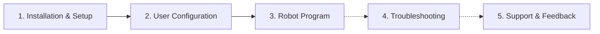

# KUKA Robots Vision Manual

!!! note

    This manual focuses exclusively on KUKA Robots-specific topics. For general robot vision information, please refer to the [wenglor robot vision manual](https://wenglor.github.io/robot-vision-generic-string/).

This repository contains an example KRL program to set up and start the generic vision interface to wenglor Machine Vision Devices on your KUKA robot.

The robot vision example for KUKA consists of the following files, available in this repository's [`sources`](https://github.com/wenglor/robot-vision-kuka/tree/main/sources) directory:

/// html | div.col-widths
    attrs: {style: "--w1: 31%; --w2: 69%;"}

| File | Description |
| --- | --- |
| `wenglorUserConfig.src` / `.dat` | User configuration (use case, poses, jobs) and the pose movement procedures. |
| `wenglorGlobal.src` / `.dat` | Core and helper functions (EKI socket communication, unit and rotation conversions, error handling). |
| `wenglorMain.src` / `.dat` | Program entry point: connects, runs the selected user command, and closes the connection. |
| `wenglorVision.xml` | EthernetKRL channel configuration (IP address and port of the robot server). |
///

!!! note

    - The example was tested with the **KUKA KRC4** robot controller, **KR 6 R1820** Arc robot arm, software **KSS 8.3.33** with **EthernetKRL 3.2.4**. It was additionally tested with **KRC5** robot controllers.

---

## How the manual is organized

1. [Installation & Setup](1_0_0_installation.md) — copy the files to the controller and configure the network connection.
2. [User Configuration](2_0_0_user_configuration.md) — adjust the KRL parameters and poses to your setup.
3. [Robot Program](3_0_0_robot_program.md) — how the KRL modules work together.
4. [Troubleshooting](4_0_0_troubleshooting.md) — common issues and how to resolve them.
5. [Support & Feedback](5_0_0_support_and_feedback.md) — where to report bugs or suggest features.

!!! note

    The generic robot vision API (commands, return values, error codes), the calibration guidelines, and the uniVision job setup are documented once in the [wenglor robot vision manual](https://wenglor.github.io/robot-vision-generic-string/4_0_0_robot_vision_server/) and are **not** repeated here. This manual only describes how the KUKA example uses them.
